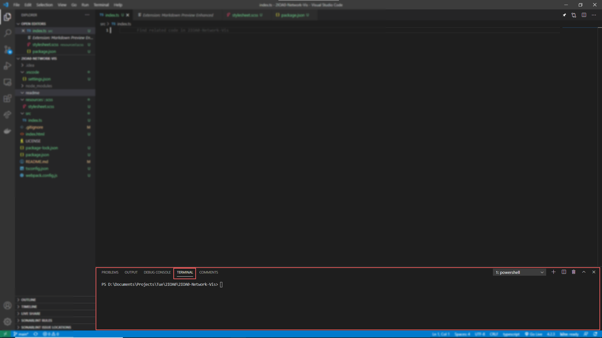

# 2IOA0-Network-Vis

2IOA0 Network visualisations

# Getting started

## Step 1: Install Node.js and Npm

Follow steps 1, 2 and 3 from [this website](https://phoenixnap.com/kb/install-node-js-npm-on-windows) to install node.js and npm on your computer.

## Step 2: Install packages

When the project is opened in visual studio code find the terminal tab on the bottom and run

<details>
<summary>Visual Studio code Terminal location</summary>
<pre>

</pre> 
</details>

```
npm install
```

This will install all of our current npm dependencies.

## Step 3: Dev Server

Before making changes to the source code run:

```
npm run dev
```

This will start up a server running at the given address [localhost:8080](https://localhost:8080).
This server will recompile and refresh the page evertime you make a change to the source code.
So while running the dev server you won't need to constantly recompile the code.
